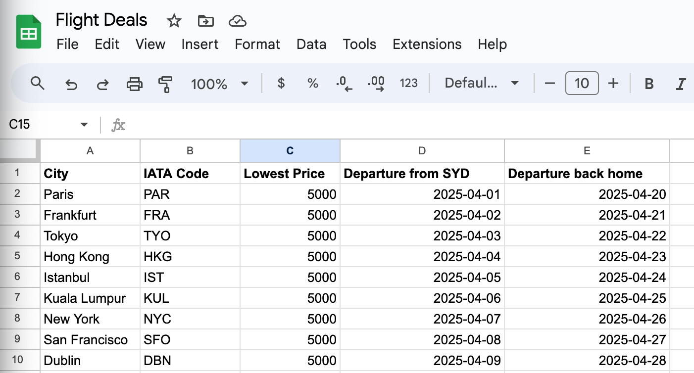

# <Flight Price Tracker>

## Description

This script will search for flights from the amadeus database that are within your budget, date and city criteria. If a flight is found it will send a whatsApp notification informing the user of that a match has been found for the flight  

I built this project in the hopes of automating the flight checking process so I can run this script autonomously online, to check for any relevant flights for me that meet my criteria and the notify me. More specifically to find any affordable flights to see my parents back in Italy. 
## Table of Contents

- [Installation](#installation)
- [Usage](#usage)
- [Credits](#credits)
- [License](#license)

## Installation

You can fork this repository and pip install all the necessary packages. You will also need to modify your google spreadsheet to make it an API and also connect your Twilio details to allow notifications to work. Use the link below as a guide for setting up your google sheets as an API.

https://developers.google.com/sheets/api/quickstart/python
## Usage

In order for the script to retrieve your data from the google sheets API, you must set up the sheet in similar format to the image below. The IATA codes are not required if you wish to not put them in, furthremore dates must be in this format, YYYY-MM-DD, for the Amadeus API to work.

You will also need to make an account on twilio and Amadeus in order to have the necessary API credentials in order to make the API calls.  

- https://developers.amadeus.com/
- https://www.twilio.com/en-us

## License

Feel free to use this project for your own personal flight tracker and modify it how you wish for your needs.